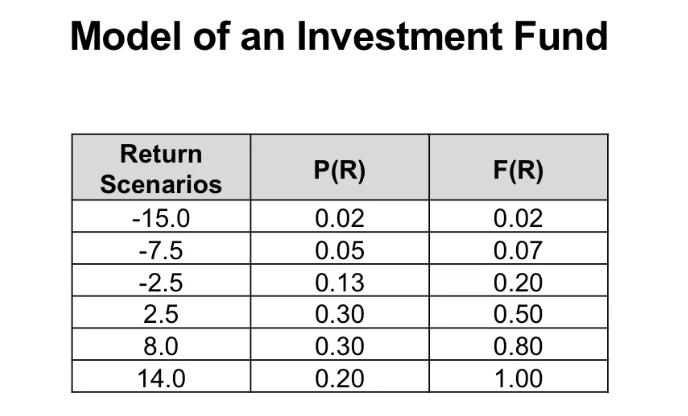

# Discrete random variables

A **random var.** assigns a single num. value to each basic outcome in the sample space.

Their names: X, Y, Z, etc.

**Disc. random var.** X can take on only a finite number of values (or at most a countably infinite number).

p(x) = P(x) = P(X=x) = Pr(x)

> P(X=x): rand. var. X takes on a specific value and then it's ordered by x.

When we sum P() we get to the concept of the Probability distribution. A probability mass function (abbreviated PMF) completely describes the probability properties of the random variable. It shows the p. that a random var. X is exactly equal to some deterministic value x.

The cumulative distribution function (abbreviated CDF) shows the p. that a random var. X takes a value less than or equal to a deterministic value x.

Notation: F(x) = P(X≤x), where -∞ < x < ∞.

> It means: F(x) = P(X=1) + P(X=2) +...+ P(X=x).

> Ex. X is the sum of the outcomes of the two dice. The state space S is {2, 3, ..., 11, 12}.
>
> P(X=2) = 1/36
>
> P(X=3) = 2/36, ..., P(X=12) = 1/36
>
> P(X=x) = 0 for all values x not in {2, 3, 4, ..., 12}
>
> - The # of pos. outcomes for X is clearly infinite, so X is a disc. rand. var.
> - All pos. outcomes for the sum of two fair dice are not equally likely (тобто ймовірність отримати 7 вище ніж отримати 2). Therefore X is not uniformly distributed.
>
> If you have a table, then you can get a graphical representation of P(X=x). Like a Column diagram, or a Staggered chart for Cumulative distribution of F(d) (for step function).

> Ex. Roulette. 0 - 36.
>
> We assume an absolute fair game. We assume that all 37 numbers are equally likely. This p. dist. is also called the **uniform probability distribution**.
>
> P(R=0) = P(R=1) = ... = P(R=36) = 1/37
>
> The Column graph gives an idea that all numbers are equally likely (all columns are similar). This is a discrete uniform distribution (every one of n values has equal p 1/n).

**Expected value**

more possible values in rand values = graph. repr. gets messy.

We like summarize info into Summary Measures.

First one is Average Mean (or Expected Value, мат. сподіванння :ukraine: ). **Mean** of a disc. rand. var. X is the probability weighted sum of all possible values.

μ = E(x) = x1 * p(x1) + x2 * p(x2) + ... + xk * p(xk)

How to understand? A: if I repeat that experiment many times, then the average will get close to μ.

>  Ex. Roulette bet on red:
>
> - red = net win of 1
> - black = net loss of 1
>
> What is the expected value? How much money will you win or lose on average?
>
> Rand. var B and its values 1 (win), -1 (lose).
>
> P(B = 1) = 18/37 = 0.4865
>
> P(B =-1) = 19/37 = 0.5135 (19 = 18 black + 1 green)
>
> E(B) = 1x18/37 + (-1)x19/37 = -1/37 = -0.027027 - this is how much chips you will lose if you will bet on this color. "House advantage" (lang. of gambling) - on avg the casino wins money.

> Ex.
>
> Offer:
>
> - Extra fee = 84$
> - Deductible = 100 $
>
> Buy the insurance?
>
> Random var = accident payment
>
> accident? damage exceeds 800 = you need to pay 800 in that case. No? 0 - no accident. A0 has two values: 800 & 0.
>
> > we neglect accident like bumper damage of say 500
>
> With extra insurance:
>
> A1 has two values: 100 & 0 (no accident).
>
> P of accident = p
>
> Expected payments:
>
> - without extra insurance:
>
> E(A0) = 800 x p + 0 x (1-p) = 800 p
>
> - with extra insurance:
>
> E(A1) + 84 = 100 x p + 0 x (1-p) + 84 = 100p + 84
>
> At which p would these payments be the same? 8 1/3 %.
>
> If p is high = buy the insurance, if p is small = you shouldn't buy the insurance.

**Measures of dispersion**

limited mind, so we like to aggregate all of this info, the possible variables, the possible p. into a single number. But there's a drawback! We lose a ton of info. 

> Ex. μ=3.5 - no indication about the **variation** in the actual numbers
>
> We have bars, 6 different numbers, there is uncertainty, there's only a 1 in 6 chance of them coming, but 3.5 doesn't give me any of that info.
>
> μ of 6 diffrent numbers = μ of die with three 1s and three 6s.

Sam Savage of Stanford University: "the flaw of averages". People rely too much on averages and ignore variation.

Simple average deviation:

Given μ = E(x) .

Take the difference E(X-μ) = (x1 - μ)p(x1) + (x2 - μ)p(x2) + ... + (xk-μ)p(xk)

This concept of average deviation doesn't work b/c: E(X-μ) = 0.

Mean absolute deviation:

MAD = E(|X-μ|) = |x1 - μ|p(x1) + |x2 - μ|p(x2) + ... + |xk-μ|p(xk)

Doesn't work in practice, b/c the abs value isn't easy, It has a kink at 0. Language of math: it has a non-differentiability at 0.

Squaring the numbers!

**Variance** of discrete random variable is the probability-weighted sum of all possible squared deviations from the mean.

> A deviation of a -2 gives a +4 squared deviation, a dev of a +2 gives us a +4 sq. dev. No more canceling of negatives and positives.

Suppose X has k possible values, x1, x2, ..., xk, then the variance of X is

σ^2 = Var(X) =  E((X-μ)^2) = (x1 - μ)^2p(x1) + (x2 - μ)^2p(x2) + ... + (xk-μ)^2p(xk)

How to get from squared euros to just euros? With the square root.

So, the standard deviation  σ = SD(X) = sqrt(Var(X)).

Standard deviation is a measure (based on the variance) for the average deviation of the values of a random variable X from its mean μ.

Our preferred summary measures for variation, or in economics and finance people like to talk about volatility, are the concepts variances and standard deviation.

**Financial model**

If anyone mentions it, they mean random variables.

They use economic models to forecast to handle economic or financial risks.

We see empirical probabilities.

Investors are interested in sum metrics, not this numbers.

Expected return:

- fund return: 

random variable R with 6 possible values

- expected return:

E(R) = (-15) x 0.02 + (-7.5) x 0.05 + ... + 14 x 0.2 = 4.95%

Again, we loss information. We now need to model the volatility (we use variance and stddev).

Variance of the return:

Var(R) = (-15-4.95)^2 x 0.02 + (-7.5-4.95)^2 x 0.05 + ... + (14-4.95)^2 x 0.2 

= 43.8975

According to our fin. model, the variance of the investment fund's return is 43.8975%^2 ("percent square").

Stddev of the return:

σ = sqrt(Var(R)) ~ 6.6255

Stddev is measure for volatility in economics and finance.
